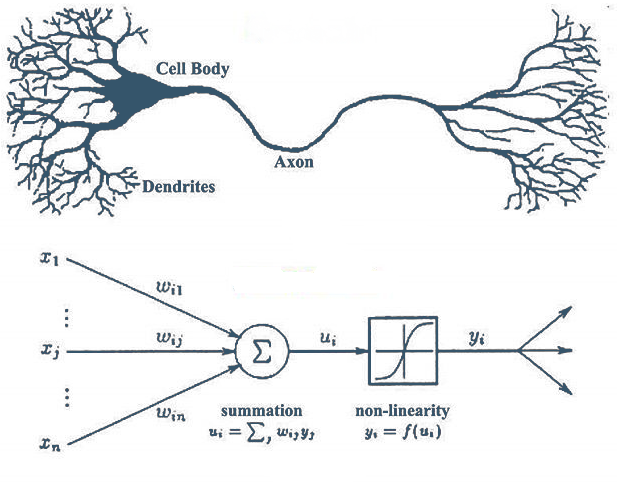
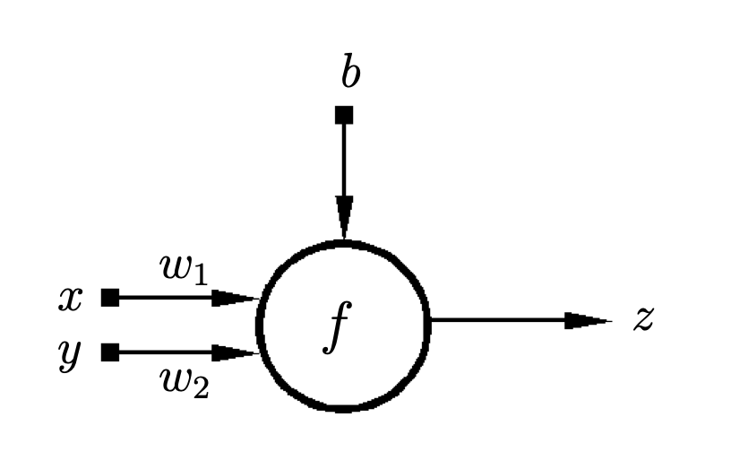

# neural_network

## Resume 

Artificial neural networks are an attempt to simulate the learning behavior of the brain. The first experiments involve connecting parts of the brain to stimulate learning

## Table of Contents

### Available library

1. [TensorFlow](https://www.tensorflow.org/)
2. [PyTorch](https://pytorch.org/)

### Types of IA tools

Artificial intelligence ⇒ Seeks to replicate human intelligence.

Machine learning ⇒ Techniques that seek to replicate machine learning.

Deep learning ⇒ Deep learning,

### Neurons

> Interconnected nerve cells

The perceptron is an artificial neuron that seeks to imitate the functioning of the brain's neurons. The objective is to have several perceivers in order to communicate with each other. This is done in order to include atypical cases. It is used in supervised learning. , in this way the weights are altered as the results coincide with the real data

$$
\begin{pmatrix}
0.8944272 & 0.4472136\\
-0.4472136 & -0.8944272
\end{pmatrix}
\begin{pmatrix}
10 & 0\\ 
0 & 5
\end{pmatrix}
$$

$$
\left(\begin{array}{cc} 
W_{11} & W_{12} & W_{13} & ... & W_{1n} \\
W_{21} & W_{22} & W_{23} & ... & W_{2n} \\
... & ... & ... &  & ...                \\
W_{m1} & W_{m2} & W_{m3} & ... & W_{mn} 
\end{array}\right)
*
\left(\begin{array}{cc} 
X_{1} \\
X_{2} \\
X_{3} \\
... \\
 X_{n}
\end{array}\right)
=
\left(\begin{array}{cc} 
X1*W_{11} + X_2 *W_{12} + X_3* W_{13} + ...  + X_n *W_{1n} \\
X1*W_{21} + X_2 *W_{22} + X_3* W_{23} + ...  + X_n *W_{2n} \\
... \\
X1*W_{m1} + X_2 *W_{m2} + X_3* W_{m3} + ...  + X_n *W_{mn}
\end{array}\right)
$$ 